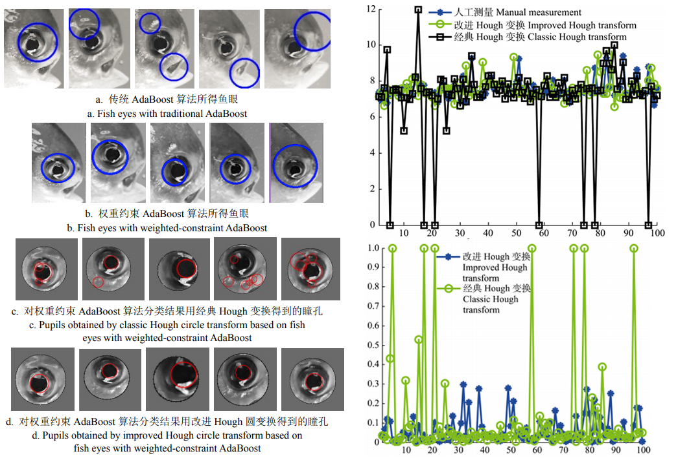

## Publication

#### Fish eye recognition based on weighted constraint AdaBoost and pupil diameter automatic measurement with improved Hough circle transform
*co-worker: Hu Zhuhua, Zhang Yiran, Zhao Yaochi, Cao Lu, Bai Yong, Huang Mengxing*  (2017/12)

In aquaculture, fisheye pupil diameters are important for the assessment of the growth of fish, which provide reference for later breeding and selection. Since fisheye pupil is embedded in the body of fish, it is harder to measure the diameter of fisheye pupil than measure body length, width and tail length. Traditional measurement of fish eye diameter in aquaculture, which is direct touching of the fish body using measuring tools, has low efficiency as well as high subjectivity since it is only based on manual work. Considering the above factors, we introduce computer vision and machine learning to the measurement of fisheye pupil diameters. An improved AdaBoost algorithm based on weighted constraint is proposed in this paper, which is used in fisheye classifier training; and an improved Hough circle transform is put forward to achieve real-time fish eye pupil diameter measurement. Firstly, in natural light conditions, fishes are placed on the base plate of a customized measuring device and are photographed using CCD (charge-coupled device) installed in the device, in which the distance between base plate and the CCD is fixed. Secondly, the Haar-like features in fish images are extracted and used to train a classifier with the improved Adaboost algorithm to distinguish whether some region is fish eye or not. The improved Adaboost algorithm is proposed based on weighted constraint, in which the weight value does not change only according to error rate but is limited by the weight value constraint. With the trained classifier of fish eye, the whole region of fish image is scanned, and fish eye region can be detected and then separated from the full image. Thirdly, the edges in the fish eye region are obtained with canny operator; noise and interference are filtered to some extent using morphologic transform. Then, we use an improved Hough circle transformation method, proposed in this paper, to circle the fish eye pupil and get its diameter. In the processing of finding a circle, 3 points are selected randomly in traditional Hough circle transform to construct a circle, while in the improved Hough circle transform proposed in this paper, the position of the 3rd point is fixed relying on the 1st and 2nd point, avoiding the problem of parameters error caused by random points. Finally, the diameter of fish eye pupil can be calculated using the conversion ratio between pixel diameter and real diameter. To validate the feasibility of the proposed method, we compare the measured data obtained by our method with the already-known standard reference data obtained from manual measurement. If the relative deviation is less than or equal to 5%, the result is considered correct. The experimental results show that the accuracy has reached 94.2% and the average relative deviation is 6.5%, which prove the validity of the data obtained by our method. In addition, the average measuring time is 324.371 ms, which is shortened significantly, compared with that of artificial measurement. Hence, the method proposed in this paper can measure the diameter of fish eye pupil timely and accurately, and reduce the complexity of traditional methods and the subjectivity of measured data. Furthermore, the method can also prevent the situation that fishes are harmed or even killed during the measurement process and require no more manual work.

#### A Sequential Compressed Spectrum Sensing Algorithm against SSDH Attack in Cognitive Radio Networks
*co-worker: Zhuhua Hu, Yong Bai, Lu Cao, Mengxing Huang, Mingshan Xie*  (2017/11/01)  

Spectrum sensing is one of the key technologies in wireless wideband communication. There are still challenges in respect of how to realize fast and robust wideband spectrum sensing technology. In this paper, a novel nonreconstructed sequential compressed wideband spectrum sensing algorithm (NSCWSS) is proposed. Firstly, the algorithm uses a sequential spectrum sensing method based on history memory and reputation to ensure the robustness of the algorithm. Secondly, the algorithm uses the strategy of compressed sensing without reconstruction, which thus ensures the sensing agility of the algorithm. The algorithm is simulated and analyzed by using the centralized cooperative sensing. The theoretical analysis and simulation results reveal that, under the condition of ensuring the certain detection probability, the proposed algorithm effectively reduces complex computation of signal reconstruction, significantly reducing the wideband spectrum sampling rate. At the same time, in the cognitive wideband communication scenarios, the algorithm also achieves a better defense against the SSDF attack in spectrum sensing. 

