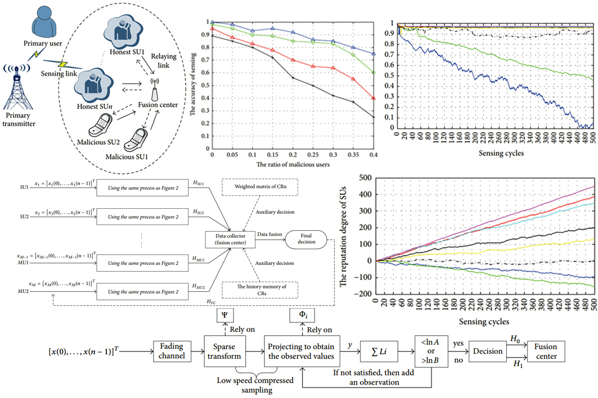

## Publication

#### A Sequential Compressed Spectrum Sensing Algorithm against SSDH Attack in Cognitive Radio Networks
*co-worker: Zhuhua Hu, Yong Bai, Lu Cao, Mengxing Huang, Mingshan Xie*  (2018/10/22 - 2018/11/22)  

Spectrum sensing is one of the key technologies in wireless wideband communication. There are still challenges in respect of how to realize fast and robust wideband spectrum sensing technology. In this paper, a novel nonreconstructed sequential compressed wideband spectrum sensing algorithm (NSCWSS) is proposed. Firstly, the algorithm uses a sequential spectrum sensing method based on history memory and reputation to ensure the robustness of the algorithm. Secondly, the algorithm uses the strategy of compressed sensing without reconstruction, which thus ensures the sensing agility of the algorithm. The algorithm is simulated and analyzed by using the centralized cooperative sensing. The theoretical analysis and simulation results reveal that, under the condition of ensuring the certain detection probability, the proposed algorithm effectively reduces complex computation of signal reconstruction, significantly reducing the wideband spectrum sampling rate. At the same time, in the cognitive wideband communication scenarios, the algorithm also achieves a better defense against the SSDF attack in spectrum sensing. 

