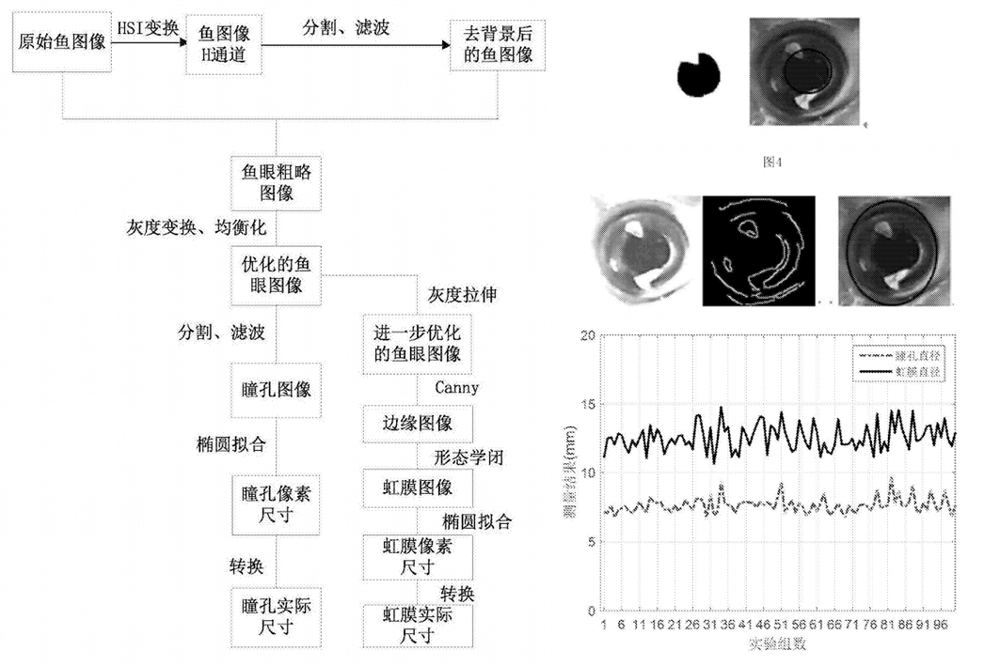

## Patents

#### Method for automatically measuring fisheye feature
*co-worker: Zhuhua Hu, Yaochi Zhao, Lu Cao*  (2017/07/17)

The invention relates to a method for automatically measuring a fisheye feature. The method comprises the following steps: acquiring a fish image and removing background; extracting a fisheye image in the fish image without the background; and determining a fisheye pixel size according to the fisheye image, and transforming the fisheye pixel size into an actual size. When the fish image is acquired, a fish image acquiring device requires to be constructed. The fish image acquiring device comprises a standard platform, a mechanical arm and an acquiring camera; the acquiring camera is connected with the standard platform through the mechanical arm; the standard platform is used for containing a fish body to be measured; the mechanical arm is used for adjusting the distance between the acquiring camera and the standard platform and the positions of the acquiring camera and the standard platform; and the acquiring camera is used for shooting the fish image. By the method, non-contact type automatic measurement is realized by a computer vision technology and an image processing technology, and the accuracy and stability of measured data are guaranteed while the measurement efficiency is greatly improved.

